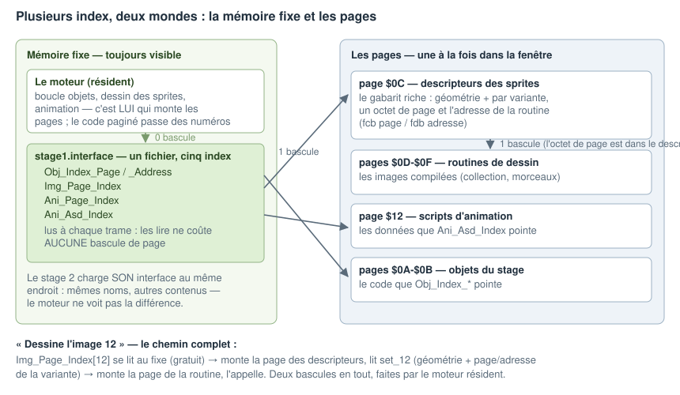

# Construire un jeu qui charge — le manuel

## 1. La machine et le problème

La mémoire d'un TO8 est découpée en pages de 16 Ko. Le programme en voit une
partie fixe — où vivent votre moteur et vos variables — et une fenêtre, dans
laquelle une page de données vient se monter quand on la demande. Un jeu
complet ne tient pas en mémoire : on charge des morceaux depuis la disquette
pendant que le jeu tourne, et on écrase ce qui ne sert plus.

Vous déclarez trois choses : **ce qui existe** (les fichiers et ce qui les
produit), **où il y a de la place** (les emplacements mémoire), **ce que
chaque écran du jeu charge** (les listes de chargement). Le builder fait le
reste : il mesure, compresse, place, écrit les tables, produit la disquette —
et refuse au build ce qui ne peut pas marcher.

Ce manuel a un compagnon : [le déroulé du
builder](manuel-cible-workflow-2026-08.md), qui raconte ce que le builder
fait de vos déclarations, étape par étape — à lire pour comprendre les
rapports et les refus. Les schémas des deux documents vivent dans `img/`.

## 2. La disquette

### 2.1 Ce que c'est physiquement

Une disquette 640 Ko a deux faces, 80 pistes par face, 16 secteurs par piste,
256 octets par secteur. La tête de lecture lit un secteur à la fois, pendant
que le disque tourne. Deux choses coûtent du temps : **déplacer la tête**
d'une piste à l'autre (un « seek »), et **attendre** qu'un secteur repasse
dessous. Tout ce que le builder fait côté disquette vise à éviter ces deux
attentes.

### 2.2 Le fichier : d'un seul tenant

Un `<file>` est l'unité de base : un contenu nommé, produit par les modules
que vous lui donnez (assembleur, convertisseur d'image, de musique, générateur
de données…), et écrit **d'un seul tenant** sur la disquette. Il se charge
d'une seule traite, sans seek interne, et se compresse d'un bloc — plus le
bloc est gros, mieux il se compresse.

```xml
<file name="stage1.music">
    <vgm2ymm filename="src/stages/01/music.vgm"/>
</file>
```

Un fichier est **indivisible** : le builder ne coupe jamais dedans. C'est vous
qui maîtrisez la taille de vos fichiers en choisissant ce que vous groupez
dedans. Limite haute : un fichier doit tenir de son adresse de chargement à
la fin d'une page — en pratique, 16 Ko au plus.

Sur la disquette, les fichiers sont collés bout à bout, à l'octet près : un
fichier peut commencer au milieu du dernier secteur du précédent. Rien n'est
perdu entre deux.

### 2.3 La compression

Chaque fichier est compressé, sauf quand ça ne paie pas — un fichier minuscule
ou déjà dense est alors stocké tel quel, et le chargeur le sait tout seul.
Vous n'avez rien à déclarer. Ce que la compression achète : moins de secteurs
lus (chargement plus rapide) et plus de contenu par disquette. La
décompression se fait après la lecture, en mémoire, pas pendant — la tête ne
l'attend jamais.

Où atterrissent les octets compressés : **directement dans l'emplacement
final du fichier**, calés à la fin (le compressé est plus court que
l'original). Une fois toute la liste lue, le chargeur déplie chaque fichier
sur place, du premier octet compressé vers le début de l'emplacement. Pas de
tampon intermédiaire, donc pas de limite au nombre ni à la taille cumulée
des fichiers d'une liste — la seule limite reste celle du fichier lui-même.

### 2.4 Les quartiers de la disquette

La disquette est divisée en quartiers nommés (les *sections*) : quelques-uns
appartiennent au système — l'amorce, le chargeur, le répertoire, les données
de liaison — et le reste est à vous. Vous dites dans quel quartier va chaque
fichier ; les fichiers d'un quartier se suivent sur les pistes.

Le builder range les fichiers d'un quartier **dans l'ordre où les listes de
chargement les demandent** : quand un écran se charge, la tête balaie les
pistes vers l'avant, sans revenir en arrière. Un fichier demandé par
plusieurs écrans est rangé pour le premier ; le rapport de chargement vous
montre, écran par écran, les retours de tête restants et ce qu'ils coûtent.

### 2.5 Le répertoire et les numéros

Le builder tient un répertoire sur la disquette : pour chaque fichier, où il
commence, combien de secteurs, s'il est compressé. Chaque fichier reçoit un
**numéro**, et c'est par ce numéro que le chargeur — et parfois votre code —
le désigne. Les numéros sont attribués par le builder ; dans votre code, vous
utilisez toujours le **nom** (une équate générée vaut le numéro), jamais un
nombre en dur : les numéros changent d'un build à l'autre.

Une entrée de répertoire coûte 8 à 24 octets. C'est le seul prix fixe d'un
fichier : beaucoup de petits fichiers = un répertoire plus long à charger.

### 2.6 La rotation, réglée pour vous

Pendant que le processeur range un secteur en mémoire, le disque tourne.
Si le secteur suivant était juste derrière, il serait déjà passé — il
faudrait attendre un tour complet. Le builder écrit donc les secteurs **un
sur deux**, et décale chaque piste pour que le premier secteur de la piste
suivante arrive sous la tête juste après le déplacement. Le chargeur connaît
ce motif. Résultat : la lecture avance au rythme du disque, sans tour perdu.
Il n'y a rien à déclarer ni à régler ; c'est décrit une fois par format de
disquette.

### 2.7 Les sorties

Le même build produit, au choix : une image `.fd` (émulateurs), `.sap`
(émulateurs, format de préservation), `.hfe` (matériel réel via lecteur
Gotek), `.sd` (lecteur SDDrive). Même contenu, mêmes numéros, mêmes
performances relatives.

### 2.8 Le démarrage

Une disquette produite démarre seule : la machine lit l'amorce, l'amorce
charge le chargeur, le chargeur charge votre première liste et saute dans
votre code. Vous ne configurez que la première liste.

## 3. La mémoire

### 3.1 Où il y a de la place

Trois déclarations, dans le `<layout>` :

- une `<zone>` : de la place — une page, une adresse, une taille ;
- un **rangement** (`<arena>`) : un nom posé sur des zones. Le builder y
  place vos fichiers et publie où chaque chose est tombée ;
- du **réservé** (`<reserved>`) : ce que la machine ou votre code occupe sans
  jamais rien y charger — tampons vidéo, variables, pile. Le déclarer rend la
  carte honnête ; rien ne peut être placé dessus.

```xml
<layout>
    <reserved name="video" page="$02" address="$0000" size="$4000"/>
    <arena name="main">
        <zone page="$04" address="$2000" size="$2000"/>
        <zone page="$05" address="$0000" size="$4000"/>
    </arena>
</layout>
```

Plusieurs rangements servent à séparer des **durées de vie** : ce qui est
chargé au début et reste (`common`), ce qui change à chaque niveau
(`stage`). On décharge un rangement d'un coup, on ne mélange pas les durées.

### 3.2 Où va un fichier : la place attitrée

Chaque fichier reçoit du builder une **place attitrée** — une page et une
adresse — choisie pour que toutes les listes qui le chargent tiennent
ensemble, et gardée d'un chargement à l'autre. Vous ne déclarez rien ; le
rapport d'occupation vous montre où tout est tombé.

Conséquence à connaître : **un fichier a un rangement — le même pour toutes
les listes.** Le même fichier ne peut pas atterrir ici dans un écran et là
dans un autre : c'est ce qui permet d'écrire les adresses à l'avance. S'il
vous faut le même contenu à deux places selon l'écran, ce sont deux
fichiers (mêmes sources, deux noms — voir 4.11) ; et un écran à la
géographie particulière déclare ses propres rangements sur les mêmes pages
(voir 4.3).

Quand une place précise compte — une table que le matériel lit, un tampon à
adresse fixe — le fichier la déclare lui-même :

```xml
<file name="hud.tiles" page="$1A" address="$3000"> ... </file>
```

**La destination est une affaire de fichier, et de fichier seulement.** Ce
que le fichier déclare — un rangement, ou une place précise — vaut pour tout
son contenu, sans exception. Ce qui doit vivre ailleurs se déclare comme un
fichier à part : la table lue à chaque trame dans un fichier de mémoire
fixe, le tampon à adresse matérielle dans son propre fichier épinglé. Un
fichier de plus est le prix d'une règle sans cas particulier — et les
petites données n'ont de toute façon rien à demander : les collections
coulent autour d'elles (4.7).

Deux fichiers peuvent déclarer **la même place** : cela dit au builder qu'ils
ne sont jamais en mémoire en même temps — l'un remplace l'autre. C'est ainsi
qu'on déclare des contenus interchangeables (le décor du niveau 1, celui du
niveau 2) quand quelque chose d'extérieur a besoin qu'ils soient au même
endroit. La plupart du temps, même ça est inutile — voir 3.3.

### 3.3 Les références entre fichiers

Quand un fichier en pointe un autre — le moteur appelle une routine du
niveau, une carte pointe ses tuiles — le builder écrit l'adresse **à
l'avance**, dans les octets mêmes du fichier sur la disquette. C'est gratuit
à l'exécution : rien à résoudre, rien à retenir. C'est possible parce que
chaque fichier a une place attitrée.

Un seul cas fait exception, et le builder le détecte seul : quand **plusieurs
fichiers proposent le même nom** — le niveau 1 et le niveau 2 exportent
chacun leur table `stage.wave` — l'adresse dépend de qui est chargé. La
référence est alors **résolue au chargement** : à chaque fois qu'une liste se
charge, le chargeur la fait pointer sur la version présente en mémoire. Ça
coûte un peu de mémoire et de temps par référence ; le rapport de fin de
build liste ce qui est résolu au chargement et pourquoi — cette liste doit
rester courte, et chaque ligne doit vous sembler normale. Une ligne
surprenante est en général un nom exporté deux fois par erreur.

En une phrase : **tout est écrit à l'avance, sauf ce qui désigne du contenu
interchangeable — et ça se voit dans le rapport.**

### 3.4 Les listes de chargement

Une `<scene>` est la liste de ce qu'un écran charge. Rien d'autre : les
places sont attitrées, il n'y a que des noms.

```xml
<scene name="scenes.stage1">
    <load name="stage1.code"/>
    <load name="stage1.tiles"/>
    <load name="stage1.map"/>
    <load name="stage1.music"/>
</scene>
```

Dans le code, trois gestes : charger une liste, la décharger, enchaîner.
**Charger n'a jamais déchargé personne** : quitter le niveau 1 pour le 2,
c'est décharger `scenes.stage1` puis charger `scenes.stage2`. Si vous oubliez
de décharger, le jeu s'arrête net au chargement suivant, avec le
qui-quoi-où — au moment de la faute, pas trois écrans plus tard sur une
corruption.

Le builder vérifie chaque liste en elle-même (rien ne s'y écrase, tout
rentre). Il ne connaît pas l'ordre de vos écrans et ne prétend pas le
vérifier : l'enchaînement est votre code.

### 3.5 Les collections et leurs tables d'accès

Certains contenus sont des **collections** : des tuiles, des images, des
ennemis — des dizaines d'éléments du même genre, que le code désigne par un
numéro et n'atteint jamais autrement que par une table.

**Ce qui fait la collection, c'est la forme du fichier.** Un fichier
ordinaire est **rigide** : un seul tenant, une seule place. Un fichier dont
chaque enfant de premier niveau sait **nommer ses parts** — un tileset
`<gfxcomp>`, des `<unit>` — est une **collection**, fluide : le builder
connaît chaque élément un par un, et peut la faire couler dans plusieurs
creux. Au placement, les fichiers rigides se posent d'abord, du plus gros au
plus petit ; puis les collections coulent dans ce qui reste. Sur la
disquette, une collection devient un ou plusieurs **morceaux** — aussi peu
que possible, chacun aussi gros que son creux le permet, chacun d'un seul
tenant et compressé. Vous n'en choisissez ni le nombre ni la taille : les
creux décident, le rapport les montre.

```xml
<file name="stage1.tiles" arena="stage">
    <gfxcomp ...les tuiles du niveau.../>   <!-- chaque tuile se nomme -->
</file>
```

**La table d'accès a deux origines, selon qui la possède.**

- Les tables de **format** sont générées par leur élément : la carte de
  tuiles (`<tilemap>`) écrit un pointeur cuit par case, l'index d'images
  (`<imageset>`) grave la géométrie et une page **par image**. Vous
  déclarez le générateur ; il remplit les adresses une fois tout placé.
- Les tables de **jeu** — quels contenus portent quels numéros d'objets,
  d'animations — s'écrivent **en assembleur, dans vos sources**. C'est une
  décision de la campagne, testée avant d'être actée : la liste des numéros
  est du gameplay, pas de la tuyauterie, et l'écrire en asm rend chaque
  ajout visible et diffable. Le builder vous donne de quoi l'écrire sans
  adresse en dur : l'adresse d'une entrée est le **symbole** exporté du
  contenu (écrite à l'avance dès que son fournisseur est placé), sa page
  s'écrit `nom$PAGE` ou se lit dans les équates publiées (`nom.page`). Les
  numéros partagés vivent dans des **équates incluses des deux côtés** — le
  résident et chaque stage incluent le même préfixe, l'invariant est
  structurel, pas promis.

Ajouter un ennemi est donc une retouche **locale et visible** : son équate
de numéro, sa ligne dans les tables des stages qui l'emploient — le builder
cuit l'adresse au placement, et le re-link du chargement repointe les tables
du moteur à chaque échange de stage.

**Où vit une table : là où vit son hôte.** Lire une table qui vit dans une
page coûte double — monter la page de la table pour lire l'entrée, puis
monter la page de l'élément pour y aller. Une table lue **à chaque trame** —
l'index des images, celui des objets — gagne donc à vivre dans un fichier de
**mémoire fixe**, celle qui est toujours visible : une seule bascule par
accès. C'est ainsi que le moteur groupe ses tables chaudes — objets, images,
animations — dans l'interface du stage (voir le deuxième exemple,
section 6).

La mémoire fixe est la ressource la plus rare de la machine — le moteur y
vit déjà. La règle simple : lue à chaque trame → hôte au fixe ; lue au
chargement ou de temps en temps → hôte en page, ce n'est pas un drame. Le
rapport d'occupation vous montre ce que le fixe porte.

Certaines tables du moteur ont un format à elles — celle des sprites porte
aussi la géométrie de chaque image. Même source, mêmes règles, autre
gabarit : vous ne voyez pas la différence.

Deux limites, toutes deux des erreurs nommées : un élément ne se coupe
jamais (plus gros qu'une page, il doit maigrir), et une collection qui
déborde de son rangement donne le manque. Et un garde-fou automatique : un
creux trop petit pour valoir un morceau — une entrée de répertoire coûte
jusqu'à 24 octets, et un petit bloc se compresse mal — reste vide plutôt que
d'émietter la collection ; le seuil se règle, le rapport montre ce qu'il
laisse.

Attention aux numéros : ceux des tables de jeu sont vos équates (stables
tant que vous ne les renumérotez pas), ceux des tables générées suivent
l'ordre de déclaration des éléments. Dans les deux cas, ne stockez jamais un
numéro dans une sauvegarde ou un mot de passe qui doit survivre à une
nouvelle version du jeu.

**Qui monte les pages.** La fenêtre ne montre qu'une page à la fois : du code
qui s'exécute *dans* la fenêtre ne peut pas en monter une autre — il
disparaîtrait sous ses propres pieds. La règle du moteur : **les numéros
voyagent, les adresses non.** Le code résident monte les pages et lit les
tables ; le code paginé — un ennemi, un objet — passe des numéros à des
services résidents, qui sauvent la page courante, montent, lisent, remontent
la sienne et reviennent. C'est déjà ainsi que le moteur travaille (« dessine
l'image n », « lance l'animation n » : vous donnez le numéro, le service fait
la bascule). La lecture d'une table existe donc en deux formes : en direct
pour le code résident, en service résident pour le code paginé.

## 4. Les cas d'usage

### 4.1 Le plus petit programme

Un fichier, une liste. Pas de layout : une zone par défaut suffit au builder
pour attribuer une place.

```xml
<file name="demo"><lwasm><asm filename="src/main.asm"/></lwasm></file>
<scene name="boot"><load name="demo"/></scene>
```

### 4.2 Une démo : code, image, musique

Trois fichiers, une liste, un rangement. Le builder place, compresse, ordonne
sur la disquette dans l'ordre de la liste — la démo charge d'une seule passe
de tête.

### 4.3 Un écran-titre et des niveaux qui se remplacent

Deux durées de vie : le moteur (chargé une fois) et l'écran courant. Deux
rangements, une liste par écran :

```xml
<arena name="common"><zone .../></arena>
<arena name="screen"><zone .../><zone .../></arena>

<scene name="boot">          <load name="engine"/> ... </scene>
<scene name="scenes.title">  <load name="title"/>  ... </scene>
<scene name="scenes.stage1"> <load name="stage1.code"/> ... </scene>
```

Le titre et les niveaux déclarent leurs fichiers dans le rangement `screen` :
le builder peut leur attribuer les mêmes pages, puisqu'aucune liste ne les
charge ensemble. Le rapport d'occupation le montre ; rien à déclarer.

Un écran à la géographie particulière — un stage bonus qui veut toute la
place pour ses décors — n'a pas à tordre les rangements des autres : il
déclare **les siens**, sur les mêmes pages. Deux rangements peuvent occuper
la même mémoire, du moment qu'aucune liste ne charge les deux à la fois —
la carte mémoire n'est pas un plan unique, c'est une carte par écran, et
c'est ainsi que le rapport la montre.

### 4.4 Un niveau plus gros qu'une page

Le cas 3.5 en vrai : les tuiles en collection (un fichier qui déclare son
index), la carte générée qui connaît la page et l'adresse de chaque tuile,
la table chargée avec le niveau. Le niveau 2 déclare sa propre collection :
mêmes numéros de tuiles, autres dessins, autre coupe — le code ne voit pas
la différence.

Si la collection déborde des zones du rangement, le build refuse en donnant
le manque. Si un seul élément dépasse une page, il est nommé : un élément ne
se coupe jamais, il faut le faire maigrir.

### 4.5 La troupe commune, chargée une fois

Le joueur, ses armes, les explosions : une collection dans le rangement
`common`, chargée au boot, jamais remplacée. Sa table — l'index des objets —
donne au moteur numéro → page + adresse de chaque habitant. Ajouter un
ennemi : une déclaration dans la collection, zéro adresse à choisir.

### 4.6 La frontière entre ce qui reste et ce qui change

Le moteur résident lit les tables du niveau courant — la vague d'ennemis, la
carte. Ces tables existent en version niveau 1 et niveau 2 : deux fichiers,
même nom exporté. C'est LE cas de la référence résolue au chargement (3.3),
et il se déclenche tout seul : vous n'avez rien déclaré, le rapport montre
quelques lignes « résolu au chargement : stage.wave — deux fournisseurs », et
c'est exactement ce que vous attendez. Tout le reste du moteur est écrit à
l'avance.

### 4.7 Remplir les queues

Il n'y a rien à faire : c'est l'ordre de placement qui s'en charge. Les
petits fichiers rigides du niveau — sa vague, ses textes — se posent avec
les autres, et les collections coulent ensuite **autour** d'eux : les queues
se remplissent toutes seules. La page d'un fichier vous est publiée en
équate quand votre code doit la monter.

### 4.8 Recommencer sans disquette

Recharger une liste déjà en mémoire ne relit pas la disquette pour rien : le
checkpoint recharge la liste du niveau, l'état repart, le disque ne tourne
que si quelque chose a réellement été écrasé.

### 4.9 Deux disquettes

Déclarez un répertoire par disquette et répartissez les fichiers. Les noms
restent uniques sur tout le jeu ; une référence d'une disquette vers l'autre
marche dans les deux sens. Quand le jeu demande un fichier de l'autre
disquette, le chargeur affiche « Insérez la disquette n » et attend. À vous
de grouper par disquette ce qui se joue ensemble — le rapport de chargement
signale une liste qui demanderait un échange au milieu d'un niveau.

### 4.10 Les données en flux

Musique, échantillons, paroles : des octets consommés en séquence par un
lecteur. Un flux vit dans UN fichier (donc une page au plus) et le lecteur le
lit dans la page montée. Pour un flux plus long, découpez-le en plusieurs
fichiers et enchaînez-les par leur table — le lecteur change de morceau, pas
de page au milieu d'un octet. Aucun contenu du moteur ne lit à cheval sur
deux pages ; ne concevez pas de données qui l'exigent.

### 4.11 Réutiliser : les mêmes ennemis aux stages 1, 4 et 7

Un fichier se déclare **une fois** et se charge depuis autant de listes qu'on
veut :

```xml
<file name="enemies.patapata"> ...ses sources... </file>

<scene name="scenes.stage1"> <load name="enemies.patapata"/> ... </scene>
<scene name="scenes.stage4"> <load name="enemies.patapata"/> ... </scene>
<scene name="scenes.stage7"> <load name="enemies.patapata"/> ... </scene>
```

C'est ça, réutiliser. La place attitrée n'est pas un obstacle — c'est elle
qui rend la réutilisation gratuite : le fichier a UNE place, choisie pour
que toutes les listes qui le chargent tiennent ensemble, et tout ce qui le
référence est écrit à l'avance une fois pour toutes. Une copie sur la
disquette, zéro décision. Et les ennemis que le stage 2 ne partage pas
peuvent recevoir la même place que lui : deux fichiers qu'aucune liste ne
charge ensemble peuvent cohabiter sur le papier.

Si aucune place ne convient à toutes les listes à la fois, le build le dit —
et il reste la deuxième forme : **recopier**. Les mêmes sources (un ennemi =
un dossier de la bibliothèque) se déclarent dans un fichier par stage, ou
dans la collection d'ennemis de chaque stage : chaque stage place sa copie à
sa façon, et l'index du stage — régénéré pour lui — pointe la sienne. La
disquette paie une copie par stage, la mémoire respire.

En bref : **partager** = une place et une copie ; **recopier** = liberté de
placement et copies multiples. Commencez par partager ; recopiez quand le
build ou le rapport vous le suggère. Sur un jeu à plusieurs disquettes, la
recopie évite en plus un échange de disquette au milieu d'un niveau.

## 5. Un exemple suivi de bout en bout

Comment s'articulent la collection, ses morceaux, le rangement et la liste —
sur le cas réel du niveau 1. (Les tailles sont illustratives.)


### Ce que vous écrivez

```xml
<layout>
    <!-- durée de vie : tout le jeu -->
    <arena name="common">
        <zone page="$04" address="$2000" size="$2000"/>
        <zone page="$05" address="$0000" size="$4000"/>
    </arena>
    <!-- durée de vie : le niveau courant -->
    <arena name="stage">
        <zone page="$18" address="$0000" size="$4000"/>
        <zone page="$19" address="$0000" size="$4000"/>
        <zone page="$1A" address="$0000" size="$4000"/>
    </arena>
    <arena name="stage.fixe">  <!-- même durée de vie, mémoire toujours visible -->
        <zone page="$01" address="$8000" size="$0800"/>
    </arena>
</layout>

<!-- une collection : 244 tuiles, ~17,8 Ko compilés — trop pour une page -->
<file name="stage1.tiles" arena="stage">
    <gfxcomp>
        <image name="tiles" filename="src/stages/01/tiles.png" grid="12x12"/>
    </gfxcomp>
</file>

<!-- la porte d'entrée des tuiles EST la carte : une table générée,
     un pointeur cuit par case -->
<file name="stage1.map"  arena="stage"> <tilemap .../> </file>
<file name="stage1.wave" arena="stage"> <lwasm .../>   </file>

<scene name="scenes.stage1">
    <load name="stage1.tiles"/>     <!-- la collection, par son nom -->
    <load name="stage1.map"/>
    <load name="stage1.wave"/>
</scene>
```

Trois lignes de `<load>`. Aucune adresse, aucune page, aucun mode, aucune
taille de coupe.

### Ce que le builder en fait

1. **Il mesure.** Chaque tuile est compilée seule : 244 éléments de 30 à
   120 octets, 17 810 octets en tout. La carte se mesure sans être
   remplie : ses cases sont à largeur fixe, sa taille ne dépend que du
   compte — 5 940 o.
2. **Il pose le rigide** dans `stage`, du plus gros au plus petit :

   | fichier | page | adresse |
   |---|---|---|
   | stage1.map (5 940 o)      | $18 | $0000 |
   | stage1.wave (610 o)       | $18 | $1734 |

   Reste un creux de 9 834 o en page $18, et les pages $19 et $1A vierges.
3. **Il coule le fluide.** La collection remplit les creux, dans l'ordre des
   tuiles : un **morceau** de 9 826 o (tuiles 0–135) dans le creux de $18,
   un morceau de 7 984 o (tuiles 136–243) en $19. Deux morceaux — pas
   cinq : les creux ont décidé de la coupe. La page $1A n'a pas servi ; le
   rapport le montre, la zone peut être rendue.
4. **Il génère, maintenant que tout est placé.** La carte est remplie :
   chaque case écrit la page et l'adresse **cuites** de sa tuile — celle de
   la tuile 137 dit « page $19, adresse $002E », la place du morceau qui la
   porte, où que la coupe l'ait mise. Tout est écrit à l'avance : zéro
   donnée de liaison pour tout ça.
5. **Il écrit la disquette.** Quatre entrées de répertoire — la carte, la
   vague, les deux morceaux — les quatre contenus compressés collés bout à
   bout dans l'ordre de la liste, et la liste elle-même devient une petite
   table sur disque : quatre fois (page, adresse, numéro).

### Ce qui se passe en jeu

- `charge(scenes.stage1)` : le chargeur lit la liste et charge les quatre
  contenus en un seul balayage de tête — chacun lu directement à sa place
  attitrée, les octets compressés calés en fin d'emplacement. Puis il les
  déplie sur place, l'un après l'autre, et résout les quelques références
  « au chargement » — ici, celle du moteur vers la carte du stage, car le
  niveau 2 exporte le même nom (le cas 4.6, la frontière).
- Le défilement veut la tuile de la case 137 : il lit la case dans la
  carte → page $19, $002E → monte cette seule page, dessine. Il ne sait
  pas — et n'a pas à savoir — dans quel morceau la coupe l'a mise.
- Fin du niveau : `décharge(scenes.stage1)`, `charge(scenes.stage2)`. Le
  niveau 2 a sa propre collection, ses propres morceaux, sa propre carte qui
  exporte le même nom — la référence du moteur pointe maintenant sur elle.
  Mêmes numéros de tuiles, autres dessins, autre coupe : le code ne voit
  pas la différence.

### L'articulation en quatre phrases

La **collection** est un fichier dont chaque élément sait se nommer : au
build, elle devient des **morceaux** — taillés par les creux — et sa table
d'accès (ici la carte, générée) est la porte d'entrée. Les morceaux sont ce
que connaissent la disquette, le répertoire et le chargeur ; vous ne les
voyez que dans les rapports. Le **rangement** est l'endroit où tout ça
reçoit sa place attitrée — et la durée de vie que ça partage. La **liste**
ne manipule que des noms : charger le nom d'une collection, c'est charger
ses morceaux ; la décharger, c'est tout lâcher d'un coup.

## 6. Deuxième exemple : cinq tables, deux mondes

Le premier exemple avait UNE collection et SA table. Un vrai stage en a
plusieurs — les objets, les images, les animations — et leurs tables ne
vivent pas là où vivent leurs contenus. C'est le montage le plus important
du moteur, le voici en entier.



### Ce que vous écrivez

```xml
<arena name="stage.fixe">    <!-- la mémoire toujours visible du stage -->
    <zone page="$01" address="$8000" size="$0761"/>
</arena>
<arena name="stage">         <!-- les pages du stage -->
    <zone page="$0A" .../> <zone page="$0B" .../> <zone page="$0C" .../>
</arena>
<arena name="common">        <!-- chargé une fois : images, animations -->
    <zone page="$0D" .../> <zone page="$0E" .../> <zone page="$12" .../>
</arena>

<!-- les collections, dans les pages -->
<file name="common.objects"  arena="common"> ...joueur, armes (des unités)... </file>
<file name="common.images"   arena="common"> <gfxcomp .../> </file>
<file name="common.anims"    arena="common"> <animation .../> </file>
<file name="stage1.enemies"  arena="stage">  ...les ennemis du stage... </file>

<!-- l'interface du stage : la boucle, l'état, ET LES TABLES — en asm -->
<file name="stage1.interface" arena="stage.fixe">
    <lwasm>
        <asm filename="src/common/objid-common.const.asm"/> <!-- numéros partagés -->
        <asm filename="src/stages/01/tables.asm"/>  <!-- Obj/Img/Ani du stage 1 -->
        <asm filename="src/stages/01/main.asm"/>    <!-- la boucle, l'état -->
    </lwasm>
</file>
```

Les tables s'écrivent **dans vos sources** : chaque entrée est le symbole du
contenu (l'adresse, cuite au placement) et sa page (`nom$PAGE`, ou l'équate
`nom.page` publiée). Les numéros communs — le joueur est le 4, ses armes
suivent — vivent dans un include **partagé par le résident et chaque
stage** : l'invariant est structurel, une divergence ne peut pas
s'exprimer. Ajouter un ennemi est une retouche locale et visible : son
équate de numéro, sa ligne dans les tables des stages qui l'emploient (le
pata-pata quelques numéros après le joueur, dans la table du stage 1 ET
celle du stage 3 s'il y revient). Les tables ont la durée de vie de leur
hôte : ici, elles se rechargent avec le stage — celles du stage 2 exportent
les **mêmes noms** avec SES contenus (les communs, plus ses ennemis).

### Pourquoi cet étage-là

Les cinq tables sont lues **à chaque trame** : au fixe, les lire est
gratuit. Leurs contenus — routines, scripts, descripteurs — sont gros et
lus **un élément à la fois** : en pages, montés à la demande. C'est la
partition chaud/froid : les petites tables chaudes au fixe, les gros
contenus froids en pages. La table des images a même deux étages : elle
pointe des **descripteurs** (le gabarit riche des sprites — géométrie plus,
par variante, un octet de page et une adresse), eux-mêmes en page, qui
pointent les routines de dessin.

### Le chemin complet, compté en bascules

« Dessine l'image 12 » : le moteur lit `Img_Page_Index[12]` au fixe
(**zéro** bascule) → monte la page des descripteurs, lit la géométrie et la
variante de l'image 12 (**une** bascule) → monte la page de la routine et
l'appelle (**deux**). C'est le moteur résident qui fait ces bascules ; un
objet paginé qui veut dessiner passe le numéro 12 à un service résident,
jamais une adresse.

Au changement de stage : `décharge(scenes.stage1)`, `charge(scenes.stage2)`
— l'interface du stage 2 arrive au même endroit avec les mêmes noms de
tables et d'autres contenus. Les références du moteur vers les tables sont
résolues au chargement (plusieurs stages offrent les mêmes noms — la règle
de 3.3 se déclenche seule) ; tout le reste est écrit à l'avance.

## 7. Quand le build refuse

Trois familles, toujours avec le fichier, la ligne et le geste à faire :

1. **Ça ne rentre pas** : un budget dépassé (le manque en octets), un élément
   plus gros qu'une page (son nom), une collection plus large que son
   rangement (le nombre de zones qu'il faudrait).
2. **C'est ambigu** : deux fichiers d'une même liste à la même place ; une
   adresse écrite à l'avance vers un nom que deux fichiers proposent à des
   places différentes ET que rien ne désigne comme interchangeable — le
   message propose les deux sorties : résoudre au chargement, ou attitrer la
   même place aux deux.
3. **Ça s'est écrasé en jeu** : pas un refus du build — l'arrêt net au
   runtime, avec qui recouvrait quoi, où. La cause la plus courante : un
   déchargement oublié.

## 8. La performance : ce qui coûte, où le voir

- **Le chargement** : secteurs lus (la compression les réduit), retours de
  tête (l'ordre disquette suit vos listes ; le rapport montre ce qui reste),
  références résolues au chargement (le rapport en donne la liste et le
  coût). La rotation est réglée d'avance, vous n'y pouvez ni bien ni mal.
- **La mémoire** : le rapport d'occupation, page par page, écran par écran —
  les creux, ce qui dort, les zones rendables. Le seuil de creux des
  collections arbitre place récupérée contre entrées de répertoire et
  compression — le rapport montre les deux plateaux de la balance.
- **La mémoire de liaison** : chaque référence résolue au chargement occupe
  le pool du chargeur tant que son fichier est en mémoire. La liste doit
  rester courte ; si elle enfle, un nom est exporté en double quelque part.

## 9. Le vocabulaire, en une ligne chacun

| mot | ce que c'est |
|---|---|
| **fichier** (`<file>`) | l'unité qu'on nomme et qu'on charge ; contenu produit par des modules |
| **élément** | un contenu nommé DANS un fichier ; jamais coupé ; hérite de la destination du fichier |
| **collection** | un fichier dont chaque élément sait se nommer (tuiles, unités) — ses éléments coulent dans les creux |
| **table d'accès** | la table numéro → page + adresse ; générée par son élément (carte, index d'images) ou écrite en asm dans son fichier hôte (objets, animations) |
| **morceau** | un bout de fichier à UNE destination contiguë = une unité de compression ; visible aux rapports seulement |
| **zone** (`<zone>`) | de la place : une page, une adresse, une taille |
| **rangement** (`<arena>`) | un nom sur des zones ; le builder y place ; c'est aussi une durée de vie |
| **réservé** (`<reserved>`) | ce que la machine ou le code occupe sans chargement ; rien ne s'y pose |
| **mémoire fixe** | la partie toujours visible ; les pages, elles, se montent une à la fois dans la fenêtre |
| **liste** (`<scene>`) | ce qu'un écran charge — des noms, rien d'autre |
| **place attitrée** | la page + adresse d'un fichier, choisie par le builder, la même pour toutes les listes |
| **écrit à l'avance** | référence résolue au build (fournisseur unique) — gratuite à l'exécution |
| **résolu au chargement** | référence vers du contenu interchangeable (plusieurs fournisseurs) — le chargeur pointe la version présente |
| **seuil de creux** | en dessous, un creux reste vide plutôt que d'émietter une collection |
