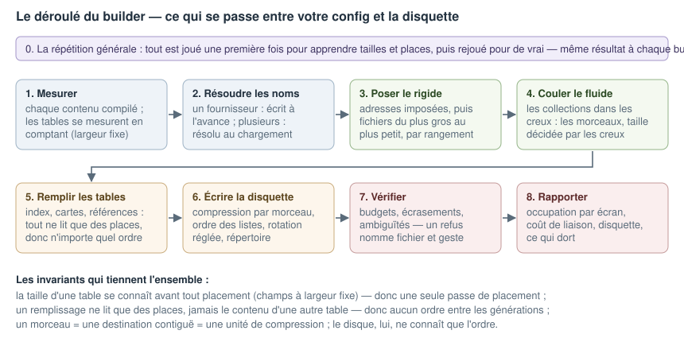
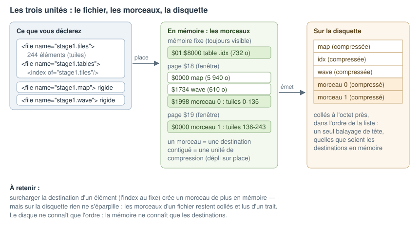

# Le builder, de la déclaration à la disquette

Le manuel dit ce que VOUS déclarez. Ce document dit ce que le builder fait de
ces déclarations — dans l'ordre, et pourquoi le résultat est le même à chaque
build. Rien ici n'est à faire : c'est ce qui se passe tout seul, à connaître
pour lire les rapports et comprendre les refus.

## 0. La répétition générale

Le builder joue tout **deux fois**. La première passe construit tout, mesure
tout, apprend où chaque chose peut aller — puis jette ses résultats. La
seconde rejoue exactement la même partition, avec les tailles et les places
apprises, et c'est elle qui écrit la disquette.

Pourquoi ? Parce que les tailles ne se connaissent qu'en construisant, et que
les places dépendent des tailles : sans répétition, la première chose
construite le serait contre des places provisoires. La répétition coûte peu —
chaque compilation et chaque compression est mise en cache, la seconde passe
retrouve tout déjà payé. Et elle garantit le déterminisme : deux builds du
même contenu donnent la même disquette, à l'octet près. C'est ce qui permet
de valider une évolution en comparant les images.

## 1. Mesurer

Chaque contenu est produit par ses modules (assembleur, convertisseurs,
générateurs) et mesuré. Les éléments d'une collection sont mesurés **un par
un** — c'est ce qui permettra de les couler dans les creux.

Les tables générées (les index, les cartes) se mesurent **sans être
remplies** : leurs enregistrements sont à largeur fixe, donc leur taille ne
dépend que de comptes — 244 entrées de 3 octets font 732 octets, où que tout
atterrisse. C'est l'invariant qui permet de tout placer en une seule passe.

## 2. Résoudre les noms

Le builder tient un registre : qui exporte quel nom, qui le référence. La
règle de résolution est mécanique :

- un nom offert par **un seul** fichier → chaque référence est **écrite à
  l'avance**, dans les octets mêmes, gratuite à l'exécution ;
- un nom offert par **plusieurs** fichiers à des places différentes — les
  contenus interchangeables, la table du niveau 1 et celle du niveau 2 → la
  référence est **résolue au chargement**, vers la version présente en
  mémoire.

Vous ne déclarez rien : la multiplicité des fournisseurs EST la déclaration.
Le rapport liste ce qui reste résolu au chargement, avec sa cause — une
ligne surprenante y est en général un nom exporté deux fois par erreur.

## 3. Poser le rigide

Le placement se fait rangement par rangement, en deux temps. D'abord le
rigide : les fichiers à **adresse imposée** prennent leur
place déclarée ; puis les fichiers ordinaires se posent **du plus gros au
plus petit** dans les zones. Un fichier chargé par plusieurs listes reçoit
UNE place, choisie pour que toutes ses compositions tiennent. Deux fichiers
qu'aucune liste ne charge ensemble peuvent recevoir la même place — c'est
ainsi qu'un titre et un niveau partagent la mémoire sans le dire.

## 4. Couler le fluide

Les collections coulent ensuite dans ce qui reste. Les éléments avancent
dans leur ordre de déclaration ; à chaque creux utilisé naît un **morceau**,
aussi gros que le creux le permet. Un creux plus petit que le seuil n'est
pas offert — mieux vaut le laisser vide que d'émietter (chaque morceau coûte
une entrée de répertoire et compresse moins bien petit).

À la fin de cette étape, chaque octet du jeu a sa place attitrée. Rien n'est
encore écrit.

## 5. Remplir

Maintenant que tout est placé, tout ce qui contient des adresses s'écrit :
les tables d'accès (numéro → page + adresse), les cartes de tuiles, les
descripteurs de sprites, et chaque référence « écrite à l'avance ». Ces
remplissages ne lisent que des **places** — jamais le contenu d'une autre
table — donc leur ordre est indifférent, quel que soit leur nombre : un
fichier peut héberger cinq index, un index peut pointer des descripteurs
eux-mêmes générés, rien ne boucle.

## 6. Écrire la disquette

Chaque morceau est compressé (ou stocké tel quel quand la compression ne
paie pas — le chargeur le sait par l'entrée de répertoire). Les fichiers
sont écrits **dans l'ordre où les listes les demandent**, collés à l'octet
près : au chargement, la tête balaiera vers l'avant. Les secteurs sont
déposés selon le motif de rotation (un sur deux, pistes décalées) pour que
la lecture avance sans tour perdu. Enfin : le répertoire (où est chaque
morceau, compressé ou non), les tables de scène (les listes, devenues des
suites de « page, adresse, numéro »), et les équates générées (les noms que
votre code assemble).

## 7. Vérifier

Avant de livrer, les refus — toujours avec le fichier, la position dans la
configuration et le geste à faire : un budget dépassé (le manque en
octets), un élément plus gros qu'une page (son nom), deux fichiers d'une
même liste qui s'écrasent, une adresse écrite à l'avance qui serait ambiguë.
Un build refusé ne laisse **aucune image** derrière lui.

## 8. Rapporter

Trois rapports, un par ressource : l'**occupation** (une carte mémoire par
écran — car la carte est par écran, pas globale — avec les creux, ce qui
dort, les zones rendables) ; la **liaison** (ce qui est résolu au
chargement, pourquoi, et ce que ça coûte au pool du chargeur) ; la
**disquette** (où est chaque octet, les retours de tête restants par
écran). Les rapports sont l'autre moitié du contrat : le builder décide
beaucoup, il montre tout.

## Le miroir : ce que fait le chargeur en jeu

Au `charge(liste)` : il lit la table de scène, charge chaque morceau
directement à sa place attitrée (page montée pendant la lecture, octets
compressés calés en fin d'emplacement), en un balayage de tête. Puis il
déplie sur place, morceau par morceau. Puis il résout les quelques
références « au chargement ». Au `décharge(liste)` : il oublie ce que la
liste avait apporté. Charger sur de l'occupé non déchargé **s'arrête net**,
avec le qui-quoi-où.

Et la règle d'accès permanente : **les numéros voyagent, les adresses non**
— le code résident monte les pages et lit les tables ; le code paginé passe
des numéros aux services résidents.

## Les invariants, pour mémoire

1. La taille d'une table se connaît avant tout placement (largeur fixe) —
   d'où une seule passe de placement.
2. Un remplissage ne lit que des places — d'où aucun ordre entre les
   générations, aussi nombreuses soient-elles.
3. Un morceau = une destination contiguë = une unité de compression — c'est
   la décompression sur place qui l'impose.
4. Le disque ne connaît que l'ordre ; la mémoire ne connaît que les
   destinations. Les deux ne se contraignent jamais l'un l'autre.
