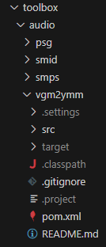

/[index]/[toolbox]/plugins

[index]: ../readme.md
[toolbox]: ./toolbox.md

# Builder Plugins

The build process make calls to internal or external plugins.
This chapter describes the steps required to add an internal or external plugin to the builder.

## External plugin

### Dependencies

A plugin need those dependencies:
- 6809-gamebuilder-spi
- 6809-gamebuilder-util (optional)

Example of Maven definition:

	<dependency>
		<artifactId>6809-gamebuilder-spi</artifactId>
		<groupId>com.wide-dot</groupId>
		<version>${project.version}</version>
		<scope>provided</scope>
	</dependency>
	<dependency>
		<artifactId>6809-gamebuilder-util</artifactId>
		<groupId>com.wide-dot</groupId>
		<version>${project.version}</version>
	</dependency>

### Plugin Type

The plugin type should be specified in a dedicated file, named:
**src/main/resources/META-INF/services/com.widedot.m6809.gamebuilder.spi.Plugin**

File content example for an **Object** Type:

    com.widedot.toolbox.audio.vgm2ymm.impl.ObjectPlugin

***TODO***
***Link to each plugin type definition***

## Internal plugin

To make an plugin part of the 6809-game-builder build process, use the steps required for an external plugin and follow thoses additionnal steps.

### Source code location

Maven project for internal plugin should be located in the **toolbox** directory.
Subdirectories are used to organize plugins by functionality.

### Module integration

Add a module definition to the **pom.xml** of the 6809-game-builder.
The value is the directory where the new plugin's pom.xml file resides.
The new module should be placed before the *./package* module.

Example:

	<modules>
		<module>./toolbox/gamebuilder/spi</module>
		<module>./toolbox/gamebuilder/util</module>
		<module>./toolbox/gamebuilder/core</module>
		<module>./toolbox/graphics/tilemap/stm</module>
		<module>./toolbox/graphics/tilemap/leanscroll</module>
		<module>./toolbox/graphics/gfxcomp</module>
		<module>./toolbox/graphics/png2bin</module>
		<module>./toolbox/graphics/png2pal</module>
		<module>./toolbox/audio/smid</module>
		<module>./toolbox/audio/vgm2ymm</module>
		<module>./toolbox/text/txt2bas</module>
		<module>./toolbox/debug</module>
		<module>./package</module>
	</modules>

### Plugin packaging

This configuration will, move the plugin jar to plugins directory during packaging steps.

Add a fileset to the following xml file :
**/package/src/main/packaging/tools-core-packaging.xml**

Example: 

		<fileSet>
			<directory>${project.parent.basedir}/repo/com/wide-dot/vgm2ymm/0.0.1</directory>
			<outputDirectory>./plugins/vgm2ymm</outputDirectory>
		</fileSet>
