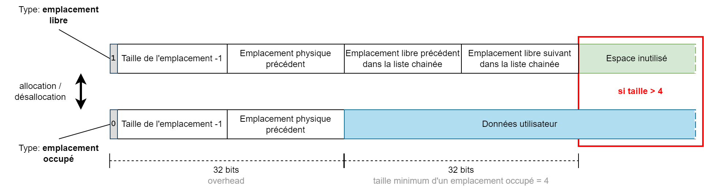
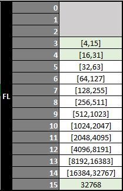
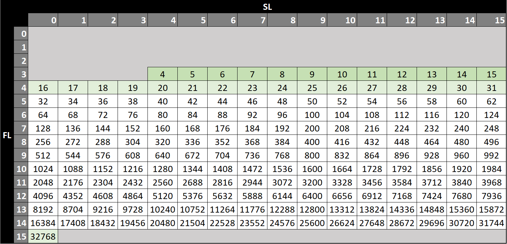

# Allocation dynamique de mémoire pour Motorola 6809

Il existe plusieurs manières d'utiliser la mémoire vive lors de l'exécution d'un programme.

**la mémoire statique**
L'utilisation de la mémoire statique (qui est réservée directement dans le programme) est une solution performante, mais elle ne constitue pas pour autant une solution à toutes les problématiques.

Sa principale contrainte réside dans le fait que la taille des données est fixée lors de la constitution de l'exécutable.

**la pile (stack)**
La pile est utilisée comme zone temporaire pour stocker les paramètres ou l'adresse de retour lors d'un appel de routine. Elle peut également être utilisée pour stockée des variables temporaires.   

Il s'agit d'une structure de données de type LIFO (Last In, First Out), son usage est donc contraint. On peut bien entendu accéder en lecture et en écriture à tout son contenu de manière indexée, mais pour libérer de la place il faut obligatoirement le faire dans l'ordre inverse de l'insertion des données.

La pile étant directement utilisée par le processeur lors des appels de routines, elle doit être positionnée dans une zone mémoire visible en permanence.   

Dans le contexte d'une routine il est possible de redéfinir la position de la pile en mémoire, il faut simplement veiller à ce que les différents changements de position restent cohérents par rapport à l'arbre d'appel des routines.

**le tas (heap)**
Le tas est un espace mémoire géré par les programmes. Son utilisation est libre mais peut nécessiter un gestionnaire si le contexte l'impose.   

Une gestion simple consiste par exemple à définir des plages d'utilisation mémoire réservées à certains objets en utilisant des positions fixes déterminées lors de l'implémentation du code.

Un gestionnaire permettra au programme :
- de mutualiser l'espace disponible (et donc faire une économie de la mémoire)
- de charger des données dont il ne connait pas la taille à l'avance.
- de libérer ou d'allouer de la mémoire dans n'importe quel ordre

Ces gestionnaires sont appelés DMA pour Dynamic Memory Allocator.

Ce document présente l'implémentation d'un DMA de type TLSF pour le processeur Motorola 6809. La mise en oeuvre a été effectuée sur Thomson TO8, mais il n'y a pas de spécificité particulière, les routines présentées ici fonctionnent sur n'importe quelle machine à base de Motorola 6809.

## TLSF (Two-Level Segregated Fit)

TLSF est un algorithme dont la complexité en temps des fonctions d'allocation et de désallocation mémoire est O(1). Le temps d'exécution est donc prévisible et ne dépend pas du niveau de fragmentation de la mémoire.

Par exemple, cela signifie qu'il n'y a pas de boucle dans le code pour effectuer la recherche d'un bloc libre d'une taille optimale lors d'une allocation (malloc). Les mécanismes employés permettent d'obtenir ce bloc libre de manière indexée.

Les résultats obtenus en terme de fragmentation mémoire sont proches d'une solution de type "best-fit".

Je vous invite à consulter les documents ci dessous pour une explication détaillée des différents types de gestionnaire d'allocation mémoire et une présentation de TLSF.

Publications :
- [A constant-time dynamic storage allocator for real-time systems.](doc/paper/jrts2008.pdf) Miguel Masmano, Ismael Ripoll, et al. Real-Time Systems. Volume 40, Number2 / Nov 2008. Pp 149-179 ISSN: 0922-6443.
- [Implementation of a constant-time dynamic storage allocator.](doc/paper/spe_2008.pdf) Miguel Masmano, Ismael Ripoll, et al. Software: Practice and Experience. Volume 38 Issue 10, Pages 995 - 1026. 2008.

### Principe de fonctionnement

Le système d'allocation mémoire TLSF est constitué des éléments suivants :

- **memory pool**   
    Il s'agit d'une zone de mémoire continue dans laquelle sont stockées les données allouées par l'utilisateur, les propriétés des emplacements libres et allouées.

- **linked list head matrix**   
    Cette matrice stocke le point d'entrée de chaque liste chainée référençant les emplacements libres du *memory pool*. Les listes chainées rassemblent des emplacements de tailles similaires.

- **first level bitmap**   
    Le premier niveau d'indexation est stocké sous la forme d'un mot de 16 bits. Chaque bit indique l'existance d'au moins une liste chainée dans le second niveau d'indexation. Le classement s'effectue par puissance de 2 sur la taille de l'emplacement.

- **second level bitmaps**   
    Le second niveau d'indexation utilise un mot de 16 bits pour chaque premier niveau d'indexation. Chaque bit indique l'existance dans la *linked list head matrix* d'une liste chainée contenant des emplacements de mémoire libres. Le classement s'effectue de manière linéaire sur la taille de l'emplacement.

#### Initialisation

L'initialisation du gestionnaire d'allocation mémoire consiste en :   

1. la réinitialisation des données *linked list head matrix*, *first level bitmap*, *second level bitmaps*
2. la création d'un emplacement libre dans le *memory pool*
3. le positionnement d'un bit dans le *first level bitmap*
4. le positionnement d'un bit dans une des *second level bitmaps*
5. le référencement d'un départ de liste chainée dans la *linked list head matrix* pointant sur l'emplacement créé dans le *memory pool* à l'étape 1

#### Stockage des données dans le *memory pool*

La création d'un emplacement libre dans le *memory pool* s'effectue par l'écriture des données d'entête suivantes à l'adresse de l'emplacement mémoire:

- [ 1 bit ] type d'emplacement (1: libre)
- [15 bits] taille-1 (3-x7FFF)   
- [16 bits] emplacement physique précédent (adresse)
- [16 bits] emplacement libre précédent dans la liste chainée (adresse)
- [16 bits] emplacement libre suivant dans la liste chainée (adresse)

Dans le cas d'un emplacement alloué, l'entête est le suivant:

- [ 1 bit ] type d'emplacement (0: alloué)
- [15 bits] taille-1 (3-x7FFF)   
- [16 bits] emplacement physique précédent (adresse)

Un emplacement libre a une taille minimum de 4 octets, cela permet de transformer un emplacement occupé (entête de taille 4 octets) en emplacement libre (entête de taille 8 octets).

L'espace libre ou alloué est localisé à la suite des entêtes d'emplacement.



Les implémentations de TLSF pour les processeurs 32bits ou plus peuvent utiliser un positionnement du bit de type d'emplacement en début de mot et non en fin (comme proposé ici). Cette solution est pertinente dans le cas où il est nécessaire de garantir un alignement des données (mots de 4 octets par exemple). Cela permet de libérer deux bits non significatifs en début du mot.   
Dans l'implémentation proposée pour le 6809, l'utilisation du bit de signe est préférable car cela permet un test plus rapide du type d'emplacement. D'autre part cela permet de conserver une allocation à l'octet près (au dela du minimum de 4).

#### Stockage des données d'indexation

Lorsqu'un emplacement libre est créé ou supprimé dans le *memory pool*, il est nécessaire de mettre à jour les données d'indexation. 

Voici un exemple de décomposition d'une taille d'emplacement de 781 octets en fonction des index de premier (fl) et second niveau (sl) :
```
0000 0011 0000 1101 = x030D = 781 octets  
______________ ____
     fl=9      sl=13
(MSB position) (value)
```

L'indexation de premier niveau (fl) s'effectue par classement de la taille de l'emplacement (minimun 4) par puissance de 2 en 13 niveaux, de fl=3 à fl=15.   

Le tableau ci dessous présente les tailles d'emplacement indexées par chaque valeur de premier niveau (fl).   


Ce résultat est obtenu en effectuant deux opérations :
- un appel à la routine Bit Scan Reverse, qui va effectuer le calcul de la position du bit le plus significatif dans la taille de l'emplacement (valeur fl).
- l'application d'un seuil minimum pour la valeur de fl. On utilise la valeur 3 pour toute taille d'emplacement inférieure à 16 (les 4 premiers bits sont utilisés par l'index de second niveau).

L'implémentation de la routine Bit Scan Reverse est la suivante:
```
;-----------------------------------------------------------------
; tlsf.bsr
; input  REG : [tlsf.bsr.in] 16bit integer (1-xFFFF)
; output REG : [B] number of leading 0-bits
;-----------------------------------------------------------------
; Bit Scan Reverse (bsr) in a 16 bit integer,
; searches for the most significant set bit (1 bit).
; Output number is bit position from 0 to 15.
; A zero input value will result in an unexpected behaviour,
; value 0 will be returned.
;-----------------------------------------------------------------
tlsf.bsr.in fdb 0 ; input parameter
tlsf.bsr
        lda   tlsf.bsr.in
        beq   @lsb
@msb
        ldb   #types.WORD_BITS-1
        bra   >
@lsb
            lda   tlsf.bsr.in+1
            ldb   #types.BYTE_BITS-1
!       bita  #$f0
        bne   >
            subb  #4
            lsla
            lsla
            lsla
            lsla
!       bita  #$c0
        bne   >
            subb  #2
            lsla
            lsla
!       bmi   >
            decb
!       rts
```
L'indexation de second niveau (sl) s'effectue par classement lineaire de la taille de l'emplacement en 16 niveaux pour chaque premier niveau (fl).   

**Exemple:** Pour un niveau fl=5, l'ensemble des valeurs indexées par le second niveau sont comprises entre 2^5 et 2^6-1, soit 32 à 63. Il y a 16 niveaux possibles pour sl, donc 32/16=2 valeurs pour chaque niveau sl.
Les valeurs sont donc :
- fl:5,sl:0 [32,33]
- fl:5,sl:1 [34,35]
...
- fl:5,sl:15 [62,63]

Le tableau ci dessous représente chaque couple fl/sl possible. Pour chaque couple on stocke un départ de liste chainée. Cette liste chainée ne contient que des emplacements libres dont la taille minimum est indiquée dans le tableau (la taille maximum n'est pas représentée pour plus de lisibilité, elle correspond à la valeur de la cellule suivante-1).   
Remarque : sont présentés en vert les cas particuliers pour lesquels une indexation exacte a lieu (pas de plage de valeurs).

