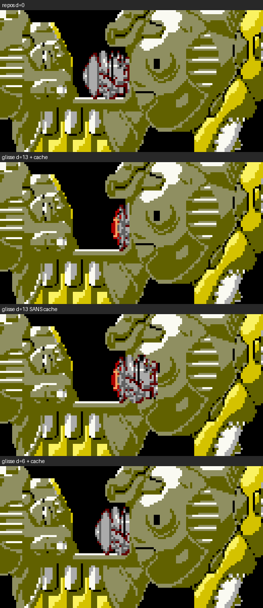

# Le noyau sans son cache de coque : découper les poses (étude, 11/09/2026)

Question de l'auteur : le cache de coque redessiné par-dessus le noyau
(`core.ShowCover`, `images/core-cover`) peut-il disparaître au profit de
poses **pré-découpées** — l'œil ne s'ouvre qu'une fois le noyau rentré sous
la coque, et le frame drop ne montre que quelques rendus de la glissade ?
Réponse courte : **oui, et c'est rentable des deux côtés** — environ
5 000 octets de moins sur la page `imgCore` et 3 000 à 4 000 cycles de moins
par rendu pendant tout le combat. Détail et réserves ci-dessous.

## 1. Ce que fait le cache aujourd'hui

Le noyau est une pièce wsmgr (priorité de fond) ; la coque est la couche
mscroll, peinte AVANT les sprites. Pour que le noyau passe SOUS la masse de
coque de droite en glissant, `gen_core_cover.py` découpe cette masse dans
`battleship.png` (fenêtre 32 × 36 à droite de la cavité) et le noyau
l'inscrit chez wsmgr juste après lui, à CHAQUE tick, dans les six phases
(fermé, glisse, ouverture, ouvert, fermeture, pompe).

Mesuré dans `gen/enemies/build/stage3-cast-imgcore.lst` (les routines
compilées, page 16, unité `stage3.cast.imgCore` = 15 026 octets sur 16 384) :

| jeu | poses | tranches | octets | octets / tranche |
|---|---:|---:|---:|---:|
| `core_anim` (fermé, pompe) | 4 | 16 | 3 551 | 222 |
| `core_opening` | 8 | 32 | 7 067 | 221 |
| `core_open` | 1 | 4 | 930 | 232 |
| `core_open_flash` | 1 | 4 | 748 | 187 |
| **`core_cover`** | 1 | **6** | **1 156** | 193 |
| `core_fire` (le feu, hors sujet) | 4 | 4 | 1 574 | |

Cycles : le profil du 10/09 donne 1 570 cycles de routines pour les 4
tranches de `core_anim` (891 octets), soit 1,76 cycle par octet de routine.
Le cache, 1 156 octets, vaut donc **≈ 2 000 cycles de routines + ≈ 1 100 de
tour** (six tranches à 120 et un slot à 350) : **≈ 3 100 cycles par rendu**
dès qu'il est dans le champ — c'est-à-dire pendant tout le combat, le noyau
étant semé à la trame 2 086 et le stage finissant à 9 280.

## 2. La géométrie, mesurée

- Le cache n'a **aucun pixel transparent dans les rangées du noyau** (lignes
  80 à 103 de la carte) : la frontière de recouvrement est une **droite
  verticale**, la colonne 364 de la carte. La cavité transparente du cache
  n'existe qu'au-dessus et au-dessous du noyau.
- Au repos le noyau couvre les colonnes 341 à 364 : **sa colonne 23 est déjà
  sous la coque** (16 pixels opaques dans chacune des 4 poses fermées, que le
  cache masque aujourd'hui). Sans cache, la pose de repos doit être rognée
  d'une colonne — sinon un liséré de noyau apparaît sur la coque.
- Glissé de `core.SLIDEPX` = 13 px, il ne montre que ses colonnes 0 à 9 :
  **10 colonnes sur 24**, 35 % des pixels opaques des poses d'ouverture.
- Les positions x sont **paires** (`layer.evenX`, sprites à 2 px, un seul
  décalage compilé) : la glissade de 36 trames n'a que 6 positions
  distinctes visibles, d = 2, 4, 6, 8, 10, 12 — et à 12 rendus pour
  100 trames, 4 à 5 d'entre elles sont effectivement peintes.

## 3. La proposition : des poses pré-découpées, plus de cache

Un générateur (`gen_core_clip.py`, à écrire) produit, depuis les PNG
existants et le masque opaque du cache pris à l'offset d, les jeux suivants,
puis `gen_warship_slices.py` les tranche comme aujourd'hui :

| phase | poses | découpe | tranches / pose | octets estimés |
|---|---|---|---:|---:|
| fermé, pompe (repos) | `core_anim` × 4 | colonnes 0-22 | 4 | ≈ 3 400 (−150) |
| glisse, recul | **une pose fixe** (fermé 0) × 6 offsets | colonnes 0..22−d | 4, 4, 4, 2, 2, 2 | **+ ≈ 2 000** |
| ouverture, ouvert, flash | 8 + 1 + 1 | colonnes 0-9 | 2 | ≈ 3 150 (−5 600) |
| cache | — | supprimé | — | **−1 156** |

Deux économies dans l'économie : les variantes de glissade d = 2, 4, 6 ne
touchent que la colonne de droite des tranches (largeur restante 5, 3 et
1 px) — leurs tranches de gauche sont **celles de la pose de repos**, les
listes wsmgr les référencent telles quelles (`fdb sets`), rien n'est
recompilé ; et les poses non rognées d'ouverture/ouvert/flash n'ont plus
d'usage, elles sont **remplacées**, pas doublées.

**Bilan mémoire** : −1 156 −5 600 −150 +2 000 ≈ **−4 900 octets** ;
`imgCore` passe d'environ 15 026 à 10 100 octets, la page 16 retrouve
6 Ko de marge.

**Bilan cycles, par rendu, noyau dans le champ** :

| poste | aujourd'hui | proposé | gain |
|---|---:|---:|---:|
| le cache (6 tranches) | ≈ 3 100 | 0 | 3 100 |
| le noyau, phases glissées (ouverture, ouvert) | 4 tranches ≈ 2 400 | 2 tranches ≈ 1 100 | 1 300 |
| le noyau, glissade | 4 tranches ≈ 2 400 | 2 à 4 tranches | 0 à 1 300 |
| le noyau au repos | 4 tranches | 4 tranches (une colonne de moins) | ≈ 100 |

Soit **3 100 à 4 400 cycles par rendu** sur les 56 700 du poste sprites de la
scène profilée (−5 à −8 %), pendant les 7 000 dernières trames du stage.

## 4. Réserves et écarts à l'arcade

1. **La pompe pendant la glissade.** L'arcade joue l'animation fermée
   (4 poses, une par 8 trames) pendant les 36 trames de glissade ; ici la
   glissade montre une pose fixe. À 4 ou 5 rendus par glissade, on saute
   4 changements de pose sur une pièce qui bouge : écart décidable, à
   consigner (`V2-DEVIATION`).
2. **La parité de `core.SLIDEPX`.** 13 est impair : la pose glissée est
   rendue à x ± 1 selon la parité de la couche, et la découpe pré-calculée
   doit correspondre au pixel. Prendre **12** (arcade 36 × 0,375 = 13,5 ;
   12 laisse 11 colonnes visibles, 14 en laisserait 9). La boîte de
   collision ouverte, élargie à gauche, ne change pas.
3. **La coque détruite.** La sous-partie 16 des épaves (x 375-396, y 96-120)
   recoupe le coin bas-droit de la zone où le noyau glisse (colonnes 375-378,
   lignes 96-103, soit 3 × 8 px). Aujourd'hui le cache y repeint de la coque
   intacte par-dessus l'épave, ce qui est déjà faux ; avec la découpe le
   noyau y reste caché sous l'épave, comme sous la coque. Dans l'arcade la
   bande du noyau garde sa priorité jusqu'à sa mort : c'est le comportement
   attendu. Rien à faire.
4. **Le flash de coup** (palette 0x55, un rendu sur deux) suit : sa pose est
   découpée comme `core_open`.

## 5. Ce que ça touche

- `tools/gen_core_clip.py` (nouveau) : masque = pixels opaques de
  `core-cover/00.png` translatés de −(COVERDX) − d ; sort
  `images/core_anim-rest/`, `core_slide-d02..d12/`, `core_opening-clip/`,
  `core_open-clip/`, `core_open_flash-clip/` ; `gen_warship_slices.py` les
  tranche (le jeu `core-cover` sort de sa liste).
- `core/obj.asm` : les six `lbsr core.ShowCover` tombent ; `core.Slide`
  choisit sa liste par `d = ((écoulées × 3) >> 3) & ~1` (table de six
  listes) ; `core.ShowClosed` sert le repos et la pompe avec le jeu rogné ;
  `core.coverMap`, `core.coverSx`, `cover.equ`, `gen_core_cover.py` et les
  images `core-cover*` disparaissent.
- `to8.config.xml` : les `<images>` de `imgCore`.
- Le test de perception : le film 1:1 (`tools/warship_video.py`) sur la
  première ouverture, à comparer à `dist/stage3-arcade-1to1.mp4`.

Une demi-journée, sans risque sur le gameplay (la boîte et les phases ne
bougent pas). Recommandation : faire.

## 6. Réalisé le 11/09/2026 — la coupe mesurée sur la machine

Avant de couper, trois captures toje (`core_shots.py`, au repos, en
glissade, ouvert) alignées pixel à pixel sur les poses :

| état | ancre lue (`AABB.cx`) | bord gauche du canevas à l'écran | colonnes sous la coque |
|---|---:|---:|---|
| repos | 128 | 116 | aucune : les 24 colonnes remplissent la cavité, la coque commence à 140 |
| glissade, dérive 1 | 39 | 28 | 22-23 |
| ouvert, glissé de 13 | 45 | 34 | 10-23 : dix colonnes visibles |

Deux règles en sortent, qui fixent la grille :

- **le moteur dessine une ancre impaire à la colonne paire SUIVANTE**
  (39 → 28 = 40 − 12 ; 45 → 34 = 46 − 12) : le bord gauche d'un sprite est
  toujours pair ;
- **H0 = 0 et la glissade de 13 était déjà rendue à 14** : dix colonnes
  visibles. La grille paire est donc `SLIDEPX = 14` (arcade 13,5), sans rien
  changer à l'image rendue, et les variantes de glissade sont d = 2, 4, …, 14.

Ce que ça donne (`gen_core_clip.py` → `gen_warship_slices.py`, qui
dédoublonne désormais les tranches identiques d'un jeu) :

| jeu | poses | tranches | octets |
|---|---:|---:|---:|
| `core_closed` (4 repos + 7 glissade) | 11 | 28 | 5 615 |
| `core_opening` (10 colonnes) | 8 | **6** | 1 092 |
| `core_open` / `core_open_flash` | 1 + 1 | 2 + 2 | 414 + 382 |
| `core_fire` (inchangé) | 4 | 4 | 1 166 |
| **`imgCore`** | | **38** (66 avant) | **8 669** (15 026 avant, **−42 %**) |

Deux bonnes surprises : la variante d = 8 n'a **aucune tranche à elle** (ses
seize colonnes visibles sont la colonne gauche de la pose de repos), et les
huit poses d'ouverture n'ont que **six tranches distinctes** — l'œil s'ouvre
sous la coque, leurs dix colonnes visibles sont presque toujours les mêmes.
Le blink (flash de coup, palette 0x55) est rogné comme la pose ouverte et
alterne au même endroit.

Par rendu, noyau dans le champ : le cache (six tranches, ≈ 3 100 cycles)
disparaît ; les phases glissées passent de quatre tranches à deux ; la
glissade en dessine deux à quatre. Le code : `core.Slide` choisit sa liste
dans `core.SlideSets` par l'écart dessiné, arrondi comme le moteur (pair
supérieur à l'aller, `SLIDEPX` moins le pair inférieur au retour), et la
boîte suit cet écart. `core.ShowCover`, `coverMap`, `cover.equ`,
`gen_core_cover.py` et les images `core-cover*` sont supprimés. Écart
consigné : la pompe fermée ne s'anime pas pendant la glissade (arcade :
quatre poses, une par 8 trames), une pose fixe à 4 ou 5 rendus par glissade.
